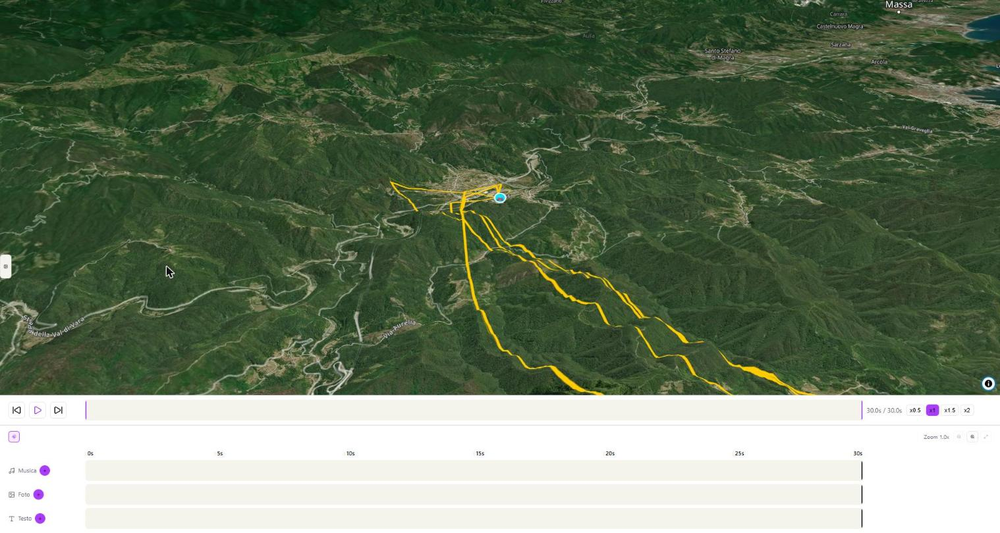

# GPX Flyover

**Trasforma una traccia GPX in un video con volo 3D animato sopra il percorso** — mappa satellitare, icona del mezzo, statistiche in tempo reale, musica e foto — tutto elaborato nel browser, senza caricare nulla su un server.

*A browser-based tool that turns a GPS track (GPX file) into a cinematic 3D flyover video over satellite terrain — fully local, no upload, no subscription.*



## Cosa fa

- Volo cinematico 3D su mappa satellitare (pitch, zoom e oscillazione panoramica regolabili, con preset pronti)
- **Multi-traccia**: più GPX nello stesso video, sincronizzati per orario GPS reale
- Icona del mezzo configurabile (moto, auto, elicottero, aereo, nave) con quota reale amplificata visivamente
- Riquadro statistiche in tempo reale (velocità, quota, rotta, coordinate, orario GMT), trascinabile in anteprima
- Timeline con musica di sottofondo e foto, con trim e dissolvenze
- Selezione dell'intervallo di export e velocità di riproduzione regolabile
- Esportazione video via WebCodecs (con fallback automatico se il browser non lo supporta)
- Salvataggio/caricamento del progetto in `.json`

## Avvio rapido

Serve [Node.js](https://nodejs.org) (LTS) e una chiave API gratuita di [MapTiler](https://cloud.maptiler.com) (per le mappe satellitari/terreno 3D).

```bash
cd gpx-flyover-app
npm install
npm run dev
```

Oppure lancia `scripts/avvia.bat` (Windows) — apre il browser automaticamente.

**Pacchetto portatile** (senza bisogno di riclonare/compilare su un altro PC): `scripts/build-produzione.bat` genera in `gpx-flyover-app/portable/` un pacchetto pronto — basta Node.js installato, si avvia con `Avvia GPX Flyover.lnk`.

## Manuale

La guida completa a tutti i campi e funzionalità è in [`istruzioni.html`](istruzioni.html) ([PDF](istruzioni.pdf)).

## C'è anche una versione con editor video

[**GPX-FlyOver-Editing-Video**](https://github.com/Aieie78/GPX-FlyOver-Editing-Video) aggiunge l'inserimento di clip video (action cam) direttamente nella timeline, con trim, audio e ducking automatico della musica.

## Licenza

[MIT](LICENSE) — © 2026 AIELLO Roberto

Se il tool ti è utile, puoi offrire un caffè via [PayPal](https://paypal.me/Aieie78) (vedi il pulsante "Sponsor" in alto).
